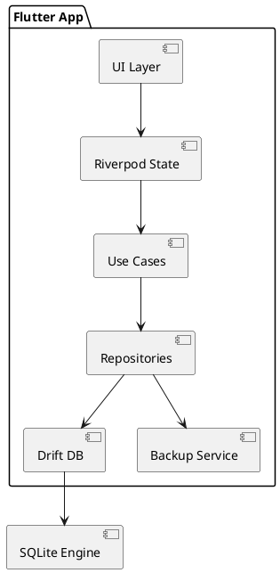

# cliniko

# Offline-Clinic-Management-System

## Background

This project aims to build a **cross-platform clinic management system** using Flutter, targeted for distribution via Google Play Store and Microsoft Store. The application is designed for **small clinics and individual practitioners**, enabling efficient patient management, scheduling, inventory tracking, and analytics.

Key constraints:
- Fully offline (no internet dependency)
- Single user, single device
- Free to use, no ads
- High-quality modern UI/UX as the primary differentiator

The system must provide a smooth, responsive, and visually impressive experience while maintaining data reliability and moderate compliance standards.

---

## Requirements

### Must Have
- Offline-first architecture (no APIs)
- Patient management (CRUD, search, semi-structured records)
- Appointment scheduling (calendar + status tracking)
- Pharmacy inventory (stock + expiry + alerts)
- Analytics dashboard (real-time, visually rich)
- Revenue tracking (basic transactions)
- Settings module (clinic info + preferences)
- Light/Dark/System theme with animations
- Local backup & restore (manual)
- Responsive UI (mobile + desktop)

### Should Have
- Audit logs (create/update/delete tracking)
- Data validation layer
- Local database encryption
- Privacy Policy & Terms of Use pages

### Could Have
- PDF export (prescriptions/invoices)
- Multi-language support
- Notifications (local reminders)

### Won’t Have
- Cloud sync
- Multi-user roles
- Online integrations

---

## Method

### Architecture

Layered clean architecture:

Presentation → State → Domain → Data

Tech stack:
- Flutter (Material 3 + custom design system)
- Riverpod (state management)
- Drift (SQLite ORM)
- go_router (navigation)
- fl_chart (analytics)

---

### Modules

- Dashboard
- Patients
- Appointments
- Inventory
- Settings
- Backup

Each module follows:
UI → Controller → UseCase → Repository → DB

---

### Database Schema

#### patients
- id (PK)
- name
- phone
- gender
- date_of_birth
- address
- created_at
- updated_at

#### medical_records
- id (PK)
- patient_id (FK)
- visit_date
- diagnosis
- notes
- prescription_text
- created_at

#### appointments
- id (PK)
- patient_id (FK)
- datetime
- status
- notes

#### medicines
- id (PK)
- name
- batch_number
- expiry_date
- stock_quantity
- unit_price
- created_at

#### transactions
- id (PK)
- patient_id (FK)
- amount
- type
- created_at

#### audit_logs
- id (PK)
- entity_type
- entity_id
- action
- timestamp

---

### Analytics Strategy

- Precomputed queries for dashboard
- Indexed fields (date, patient_id)
- Reactive streams via Drift

Dashboard components:
- KPI cards
- Revenue charts
- Patient trends
- Inventory insights

---

### UI/UX System (Gold-Standard Design System)

Design direction: **Modern SaaS + subtle glassmorphism**, inspired by Linear-level polish, with strict consistency across all modules.

#### Design Principles
- Consistency over decoration
- Motion with purpose (no unnecessary animation)
- Data-first clarity (dashboard readability > visuals)
- Minimal cognitive load

---

#### Design Tokens (Single Source of Truth)

**Spacing Scale (8pt system):**
- 4, 8, 12, 16, 24, 32, 40, 48

**Border Radius:**
- Small: 8
- Medium: 12
- Large (cards): 16–20

**Elevation:**
- Use soft shadows + backdrop blur instead of heavy elevation

**Color System:**
- Neutral base (gray scale)
- Primary accent (clinic brand color)
- Semantic colors (success, warning, error)
- Dark mode uses true dark surfaces (not gray)

---

#### Glassmorphism Rules (Strict Usage)

Apply ONLY to:
- Dashboard cards
- Modals
- Navigation panels

Style:
- Background: semi-transparent (opacity 0.6–0.85)
- Blur: 10–20px
- Border: 1px subtle light border

Avoid overuse → keep readability high

---

#### Core Components (Reusable)

**AppShell Layout**
- Desktop: Sidebar + Topbar + Content
- Mobile: Bottom nav + collapsible sections

**Cards (Primary UI Unit)**
- KPI Card
- Data Card
- Action Card

All cards must:
- Share same padding
- Same radius
- Same animation behavior

**Buttons**
- Primary (filled)
- Secondary (outlined)
- Ghost (minimal)

**Inputs**
- Floating labels
- Clear validation states

---

#### Dashboard UX (Signature Experience)

Structure:
- Header (clinic info + quick stats)
- KPI Row (animated cards)
- Charts Grid
- Activity Feed (recent actions)

**Animations:**
- KPI numbers: count-up animation (300–600ms)
- Charts: progressive draw animation
- Cards: fade + slight upward motion

**Performance Rule:**
- Never block UI thread
- Use memoized providers for all metrics

---

#### Motion & Micro-interactions

- Page transitions: Shared Axis (Material Motion)
- Hover (desktop): scale 1.02 + shadow increase
- Tap: subtle shrink (0.97 scale)
- List updates: animated insert/remove

Duration guidelines:
- Fast: 150ms
- Normal: 250ms
- Complex: 400ms

---

#### Responsiveness Strategy

**Mobile:**
- Single column
- Bottom navigation

**Tablet:**
- Two-column layout

**Desktop:**
- Multi-column dashboard grid
- Sidebar navigation

Grid system:
- 12-column layout for desktop

---

#### Typography

- Font: Inter / SF Pro equivalent
- Scale:
  - Title: 24–32
  - Section: 18–20
  - Body: 14–16
  - Caption: 12

Use medium weight for emphasis instead of bold overload

---

#### Consistency Enforcement

- All UI built from shared components ONLY
- No inline styling in feature modules
- Theme + tokens strictly enforced
- Design review checklist before release

---


### Backup & Restore

Export:
- Serialize DB → JSON
- Compress → ZIP

Import:
- Validate schema
- Replace DB safely

---

### Performance Strategy

- Indexed queries
- Lazy loading lists
- Minimal rebuilds
- Memoized providers
- Background isolates for heavy tasks

---

### Component Diagram



---

### Navigation & App Structure

**Navigation Style:** Sidebar (Linear-inspired) with collapsible behavior

**Primary Sections (ordered):**
1. Dashboard
2. Patients
3. Appointments
4. Inventory
5. Settings

---

#### Layout System

**Desktop (Windows):**
- Left Sidebar (collapsible)
- Topbar (search, quick actions)
- Content Area (dynamic)

**Mobile (Android):**
- Bottom Navigation (5 tabs)
- Floating Action Button (contextual)

---

#### Routing (go_router)

Route structure:
- /dashboard
- /patients
- /patients/:id
- /appointments
- /inventory
- /settings

Nested routing used for detail screens (e.g., patient profile)

---

#### Navigation Behavior

- Sidebar collapse animation (200ms)
- Preserve scroll/state per tab
- Deep linking ready (future-proofing)

---

## Implementation

### Project Structure (Optimized for Solo Developer)

```
lib/
 ├── core/
 │    ├── db/
 │    ├── theme/
 │    ├── routing/
 │    ├── utils/
 │    └── widgets/
 │
 ├── features/
 │    ├── dashboard/
 │    ├── patients/
 │    ├── appointments/
 │    ├── inventory/
 │    └── settings/
 │
 ├── services/
 │    ├── backup_service.dart
 │    └── audit_service.dart
 │
 └── main.dart
```

---

### Module Structure (Example: Patients)

```
patients/
 ├── data/
 │    ├── patient_dao.dart
 │    ├── patient_repository.dart
 │
 ├── domain/
 │    ├── patient_model.dart
 │    └── usecases/
 │
 ├── presentation/
 │    ├── providers/
 │    ├── screens/
 │    └── widgets/
```

---

### State Management (Riverpod Pattern)

- Use `StateNotifierProvider` for feature state
- Use `StreamProvider` for reactive DB updates
- Use `FutureProvider` for one-time loads

Example flow:
UI → Provider → Repository → Drift DB

---

### Database Setup (Drift)

- Single database instance
- Use DAOs per module
- Add indexes for performance (date, patient_id)

---

### Routing Setup (go_router)

- Centralized router config in `core/routing`
- ShellRoute for shared layout (sidebar/topbar)

---

### Backup Service Strategy

- Export:
  - Read all tables
  - Convert to JSON
  - Compress to ZIP

- Import:
  - Validate schema version
  - Replace DB safely

---

### PDF Export (Prescriptions/Invoices)

- Use `pdf` package
- Generate structured templates
- Save/share locally

---

### Performance Rules (Strict)

- Avoid rebuilding entire screens
- Use `const` widgets wherever possible
- Split large widgets into smaller components
- Use isolates for heavy JSON parsing

---

### Development Workflow

1. Build core (theme, routing, DB)
2. Implement Patients module fully
3. Reuse patterns for other modules
4. Build Dashboard last (depends on all data)

---

## Milestones

1. Project Setup (Week 1)
2. Database + Core Architecture (Week 2)
3. Patient + Appointment Modules (Week 3–4)
4. Inventory Module (Week 5)
5. Dashboard (Week 6)
6. Backup & Settings (Week 7)
7. UI Polish & Optimization (Week 8)
8. Release तैयारी (Week 9)

---

## Gathering Results

Success metrics:
- App runs fully offline without errors
- Dashboard loads <300ms
- Smooth 60fps UI
- Zero data loss during backup/restore
- Positive usability feedback

Testing:
- Unit tests (logic)
- Integration tests (DB + modules)
- Manual UX testing

---

## Legal & Compliance

### Privacy Policy (Summary)

Cliniko is designed as an **offline-first clinic management tool**. All data entered into the application is stored **locally on the user's device** and is never transmitted to external servers.

Key points:
- No data collection or tracking
- No internet transmission of patient data
- Users are fully responsible for safeguarding their device
- Backup files are stored locally and must be protected by the user

The app does not access:
- Location data
- Contacts
- External servers

---

### Terms of Use (Summary)

Cliniko is provided as a **productivity tool for clinics and healthcare practitioners**.

- The app is **not a certified medical system**
- Users are solely responsible for:
  - Data accuracy
  - Medical decisions
  - Compliance with local healthcare regulations

The developer assumes **no liability** for:
- Data loss due to device failure
- Incorrect medical usage
- Regulatory non-compliance

---

### Disclaimer

Cliniko does not replace professional medical systems or regulatory-compliant healthcare software. It is intended to assist with record keeping and operational efficiency only.

Users must ensure they comply with applicable laws and standards in their region.

---

## End of Statement
